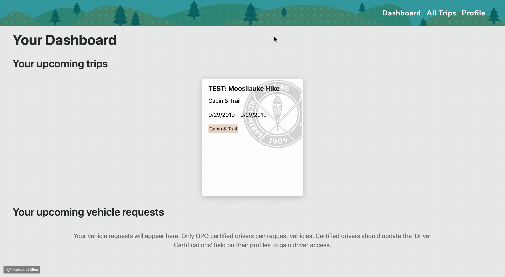
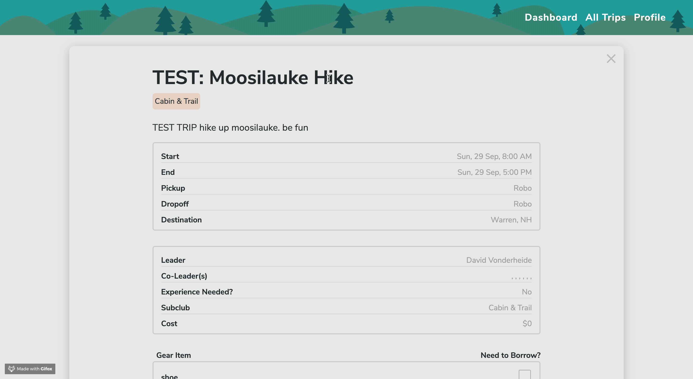
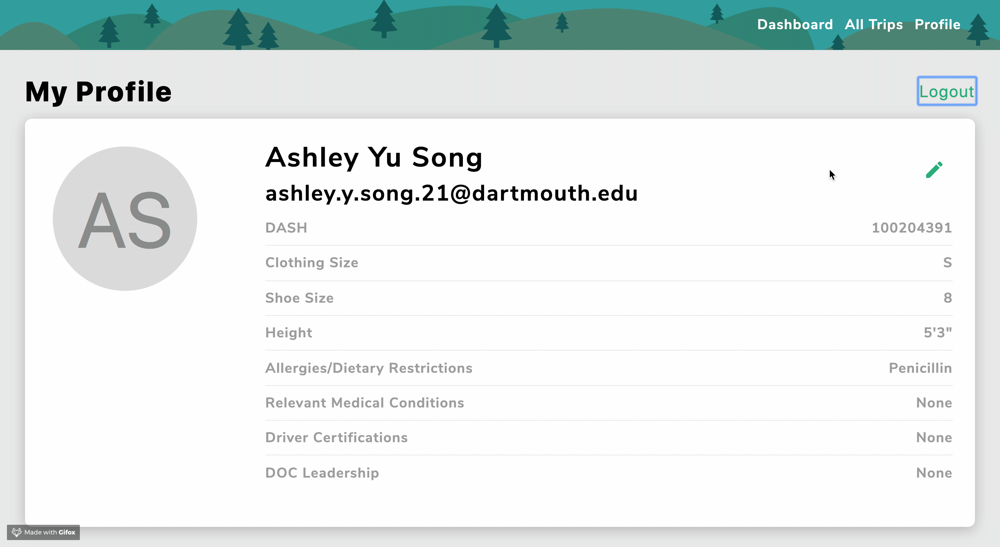

# doc-planner (client)

This project is creating a web app that allows for members of the Dartmouth community 
to more easily browse, create, and sign up for Dartmouth Outing Club (DOC) trips. We 
aim to revamp and simplify the process for both trip leaders and students.

Demo:
Browse trips across all DOC clubs or by specific clubs:

Signing up and cancelling for a trip is as easy as clicking a button:

Users can easily edit their critical info, such as emails and dash numbers, and have it sent to all of their trips:

Other features such as maintaining/creating trips, adding leaders and certifications, and managing members are only accesible for DOC Operational team and Trip Leaders. 

## Architecture

The client is built using a combination of React/Redux, with Bootstrap for styling. The 
server is built using Node.js and Express.js, with a MongoDB database.
The server is built using Node.js, Babel, and Express.js, with a MongoDB database.

## Usage
The official website is live and can be found at: http://doc-signups.dali.dartmouth.edu/
Sign in requires Dartmouth Authentication with DUO.

## Created By:
DALI Lab Team

## Acknowledgments
Thanks to Tim Tregubov and the DOC leadership team for their partnership throughout the project!
